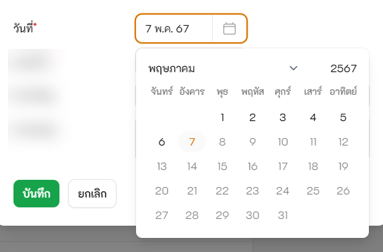

# FilamentPHP Thai Date Picker Form Component

[](https://packagist.org/packages/phattarachai/filament-thai-date-picker)
[](https://github.com/phattarachai/filament-thai-date-picker/actions?query=workflow%3Arun-tests+branch%3Amain)
[](https://github.com/phattarachai/filament-thai-date-picker/actions?query=workflow%3A"Fix+PHP+code+styling"+branch%3Amain)
[](https://packagist.org/packages/phattarachai/filament-thai-date-picker)

ปฏิทิน Thai Date Picker สำหรับ Filament 3 Form Component
วัน/เดือน/ปีที่แสดงใน Form เป็นภาษาไทย แต่เก็บเข้า Model เป็นปี ค.ศ.ตามปกติ



## วิธีติดตั้ง

Run คำสั่ง composer require เพื่อติดตั้ง Package

```bash
composer require phattarachai/filament-thai-date-picker 
```

ทำการ publish ไฟล์ javascript ถ้าหากไม่ได้ run คำสั่งนี้อยู่แล้วในไฟล์ composer.json "post-autoload-dump"

```bash
php artisan filament:upgrade 
```

## วิธีใช้งาน

ใช้เหมือน DatePicker ปกติ แต่เรียกใช้ class ThaiDatePicker แทน

```php
use Phattarachai/FilamentThaiDatePicker;

ThaiDatePicker::make('order_date')
    ->label('วันที่สั่งซื้อ')
    ->suffixIcon('heroicon-o-calendar')

```

## ผู้พัฒนา

🙋‍♂️ สวัสดีครับ ผมอ๊อฟนะครับ เป็น Full Stack Web Developer
รับ Implement งาน Project ทางด้าน Web Application สำหรับองค์กร ธุรกิจ SME ส่วนงานราชการและบริษัทขนาดใหญ่ครับ  
https://phattarachai.dev

line:
[phat-chai](https://line.me/ti/p/~phat-chai)

## License

The MIT License (MIT).
