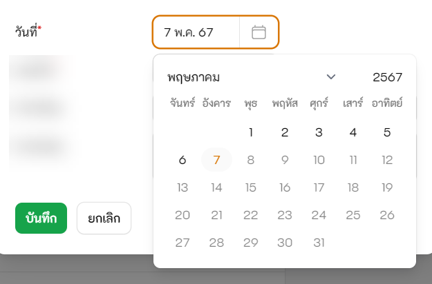

# FilamentPHP Thai Date Picker Form Component

[](https://packagist.org/packages/phattarachai/filament-thai-date-picker)
[](https://packagist.org/packages/phattarachai/filament-thai-date-picker)

ปฏิทิน Thai Date Picker สำหรับ Filament Form Component
วัน/เดือน/ปีที่แสดงใน Form เป็นภาษาไทย (พ.ศ.) แต่เก็บเข้า Model เป็นปี ค.ศ.ตามปกติ



## Version ที่รองรับ

| Filament   | ThaiDatePicker | สถานะ          |
|:-----------|:---------------|:---------------|
| 5.x        | 3.x            | เวอร์ชันปัจจุบัน |
| 4.x        | 2.x            | ใช้งาน |
| 3.x        | 1.x            | หยุด support |


## วิธีติดตั้ง

Run คำสั่ง composer require เพื่อติดตั้ง Package

```bash
composer require phattarachai/filament-thai-date-picker
```

ทำการ publish ไฟล์ javascript (ถ้าหากไม่ได้ run คำสั่งนี้อยู่แล้วในไฟล์ composer.json `post-autoload-dump`)

```bash
php artisan filament:upgrade
```

## วิธีใช้งาน ThaiDatePicker

ใช้เหมือน DatePicker ปกติ แต่เรียกใช้ class ThaiDatePicker แทน

```php
use Phattarachai\FilamentThaiDatePicker\ThaiDatePicker;

ThaiDatePicker::make('order_date')
    ->label('วันที่สั่งซื้อ')
    ->suffixIcon('heroicon-o-calendar')

```

แบบ มีเวลา

```php
use Phattarachai\FilamentThaiDatePicker\ThaiDateTimePicker;

ThaiDateTimePicker::make('transfer_at')
    ->label('เวลาที่โอน')
    ->suffixIcon('heroicon-o-calendar')

```

โดยปี พ.ศ.จะใช้สำหรับการแสดงผลเท่านั้น เวลาใช้งาน state เพื่อบันทึกลงฐานข้อมูลจะได้เป็นปี ค.ศ. ตามปกติ

```php

$data = $this->form->getState();
// $data['order_date'] = '2024-05-17'

```

## การแสดงวันที่ภาษาไทยใน Infolist

นอกจาก Datepicker แล้วใน package นี้เพิ่ม method `thaidate()` และ `thaidatetime()`
สำหรับช่วยการแสดงผล Infolist วันที่ปี พ.ศ. ภาษาไทย

```php
use Filament\Infolists\Components\TextEntry;

TextEntry::make('order_date')
    ->label('วันที่สั่งซื้อ')
    ->thaidate(),
    // 18 พ.ค. 67
```

```php
use Filament\Infolists\Components\TextEntry;

TextEntry::make('created_at')
    ->label('วันที่สร้าง')
    ->thaidatetime(),
    // 18 พ.ค. 67 12:05
```

ถ้า field วันที่ เป็นค่า null ได้แล้วแล้วต้องการให้แสดงค่า default สามารถส่ง parameter default ไปใน function ได้

```php
use Filament\Infolists\Components\TextEntry;

TextEntry::make('confirm_date')
    ->label('วันที่ยืนยัน')
    ->thaidate(default: '-'),
    // -
```

## การแสดงวันที่ภาษาไทยใน Table Column

เช่นเดียวกับ Infolist package นี้เพิ่ม macro method `thaidate()` สำหรับการ format
การแสดงผลคอลัมน์วันที่เพื่อให้แสดงผลเป็นปี
พ.ศ. ภาษาไทย ได้เลย

```php
use Filament\Tables;

Tables\Columns\TextColumn::make('order_date')
    ->label('วันที่')
    ->thaidate()
    // สามารถระบุ date format ได้เหมือน function date_format ของ PHP
    // default format เป็น d M y
    // เช่น 18 พ.ค. 67

```

ถ้าเป็น วันที่และเวลาใช้ method `thaidatetime()`

```php
use Filament\Tables;

Tables\Columns\TextColumn::make('created_at')
    ->label('วันที่สร้าง')
    ->thaidatetime()
    // default format เป็น d M y H:i
    // เช่น 18 พ.ค. 67 12:00

```

## สำหรับนักพัฒนา

### การอัปเดต View ให้ตรงกับ Filament เวอร์ชันใหม่

Package นี้ใช้ Blade view ที่คัดลอกมาจาก Filament ต้นฉบับ แล้วแก้ไขเพียง 4 จุดเท่านั้น
เมื่อ Filament อัปเดตเวอร์ชัน สามารถ sync view ใหม่ได้ด้วยคำสั่งเดียว

```bash
php bin/sync-view.php /path/to/laravel-project
```

รายละเอียดจุดที่แก้ไขจาก Filament ต้นฉบับ ดูได้ที่ไฟล์ [SYNC.md](SYNC.md)

## ผู้พัฒนา

สวัสดีครับ ผมอ๊อฟนะครับ เป็น Full Stack Web Developer
รับ Implement งาน Project ทางด้าน Web Application สำหรับองค์กร ธุรกิจ SME ส่วนงานราชการและบริษัทขนาดใหญ่ครับ
https://phattarachai.dev

line:
[phat-chai](https://line.me/ti/p/~phat-chai)

## License

The MIT License (MIT).
